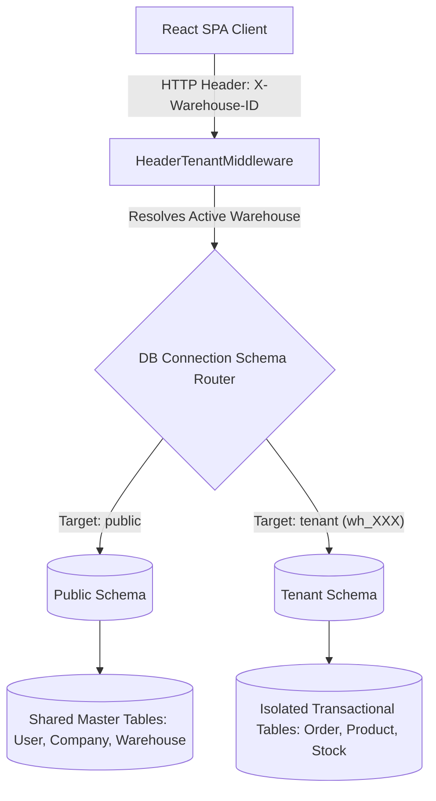

# 🏗️ Simply Useful — System Architecture (ARCHITECTURE.md)

Simply Useful is engineered as a decoupled, multi-tenant web application with a specialized OLAP-style analytics warehouse integrated directly into the database.

---

## 🛠️ Technology Stack

| Layer | Technologies Used |
| :--- | :--- |
| **Frontend UI** | React 18, Vite (Dev & Build), TypeScript, Tailwind CSS, shadcn/ui components (Radix UI primitives). |
| **State Management** | TanStack Query (React Query v5) for asynchronous server synchronization, React Context for sync local state (Auth, Active Warehouse, Selected Financial Year). |
| **Data Visualization** | Recharts (dynamic lines, bars, heatmaps, and pies). |
| **Backend Gateway** | Django 4, Django REST Framework (DRF). |
| **Authentication** | Custom JWT authentication and refresh token rotation (`api.auth.JWTAuthentication`). |
| **Database** | PostgreSQL. Multi-tenancy is implemented at the schema level. |
| **Analytics Core** | Custom transactional ETL engine utilizing a Kimball Star Schema design inside the tenant context. |

---

## 🏬 Multi-Tenancy Architecture

The application uses the `django-tenants` library to achieve complete schema-level database isolation. This allows a single backend instance and database to host separate, isolated workspaces for each physical warehouse.



### 1. The Public Schema (`public`)
Holds data that is shared globally across the company and does not belong to an isolated warehouse workspace:
* **Company:** Global organizational settings, custom SKU prefixes, and company-level variables.
* **User:** Roster records, credentials, passwords, role flags, and monthly targets.
* **Warehouse:** Registry of all warehouses (maps directly to tenant schemas via the `TenantMixin` class).
* **Domain:** Schema routing domain mappings (`DomainMixin`).
* **UserWarehouseAccess:** A join table defining which users are permitted to select and view specific warehouses.
* **Broadcast:** Regional notices displayed on dashboard feeds.

### 2. Tenant Schemas (`wh_XXX`)
Each active warehouse has its own dedicated schema (e.g. `wh_1`, `wh_2`), which isolates the daily operational transactions:
* Products, categories, brands, stock batches, and suppliers.
* Orders, order items, purchases, and purchase orders.
* CRM leads, lead follow-ups, and stage histories.
* Sales Officer visits, expense claims, and attendance check-ins.

---

## 📡 Tenant Routing Middleware

Schema selection for each HTTP request is managed on the backend by [HeaderTenantMiddleware](file:///D:/cost%202/simply-useful/simply-useful/simply-useful/backend/core/middleware.py).

### How it works:
1. The frontend interceptor injects the custom `X-Warehouse-ID` header on all outbound requests.
2. The middleware reads `X-Warehouse-ID` (or `x-warehouse-id`).
3. If the header is missing, it runs a self-healing fallback to route the connection to the first active warehouse schema to prevent server-side errors.
4. Once resolved, it switches the active PostgreSQL connection's search path:
   ```sql
   SET search_path TO wh_XXX, public;
   ```
5. If the user is a `SUPERADMIN` executing global actions, the database resolves to the public schema where data aggregation takes place across all warehouses.

---

## 📊 Analytics Star Schema (OLAP)

To prevent slow reporting queries, the transactional tables (OLTP) are periodically compiled into an optimized Kimball Star Schema within each tenant's database context.

### The ETL Pipeline (`analytics_etl.py`)
Triggered on demand or during report rendering, [analytics_etl.py](file:///D:/cost%202/simply-useful/simply-useful/simply-useful/backend/api/services/analytics_etl.py) executes the following tasks inside an atomic database transaction:
1. Re-creates the core analytical dimensions and facts.
2. Resolves Sales Officer history using Slowly Changing Dimension (SCD) Type 2 tracking in `DimSO` (`start_date`, `end_date`, `is_current`).
3. Populates `FactSales`, `FactVisits`, and `FactExpenses` with calculations for Net Revenue (`Gross Sales / 1.18`), Landed Costs (`Quantity * (Rate * 0.75)`), and tax margins.
4. Generates predictions and scans for threshold warnings to populate `AnalyticsAlert`.

### Schema Map:
* **Dimensions:**
  * `DimDate`: Calendar dates, fiscal year mappings, quarters, and weekend flags.
  * `DimSO`: Sales Officers with SCD Type 2 historic records.
  * `DimProduct`: SKU details, GST, and landed unit costs.
  * `DimWarehouse`: Warehouse names and geographic locations.
  * `DimCustomer`: Mapped dealers and distributors, cities, and statuses.
* **Fact Tables:**
  * `FactSales`: Captures volume, price, net revenue, margins, and taxes per order line.
  * `FactVisits`: Records visit durations, customer contexts, and active dates.
  * `FactExpenses`: Groups business expenses by category, amount, and date.
* **Projections & Alerts:**
  * `AnalyticsAlert`: Churn risks, margin drop warnings, and stock alerts.
  * `ForecastSnapshot`: Projections for inventory stock levels.
